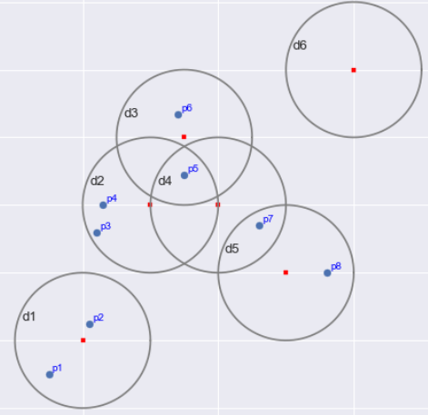
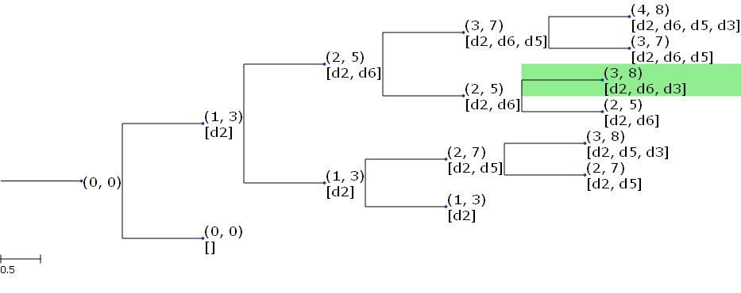
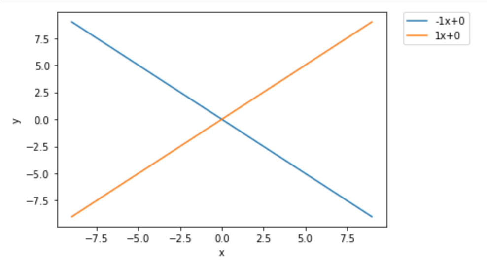
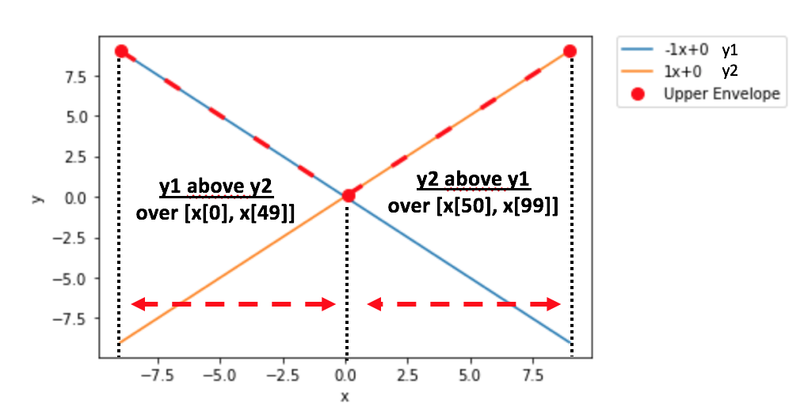
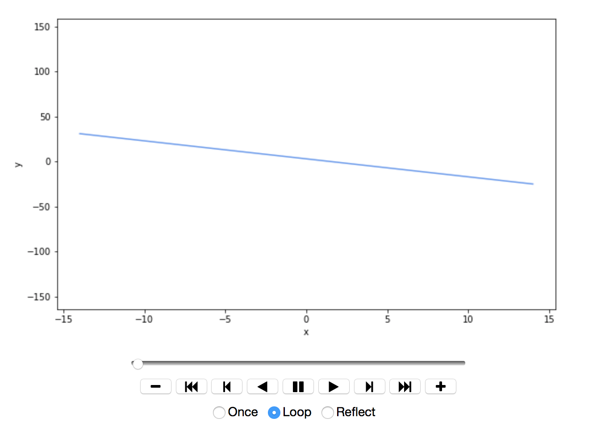

# AAP
Advanced Algorithm and Programming - solutions for DUDC and Upper envelope problems.

## Contents

* [Getting Started](#start)
* [Discrete Unit Disk Cover](#dudc)
* [Upper Envelope of Some Linear Functions](#ue)
* [Dependencies](#dep)
* [Authors](#au)

## Getting Started<a name="start">

This project tackles two problems which are known to be NP-hard : the Discrete Unit Disk Cover and the Upper envelope problem. It is a project assignment for the *Advanced Algorithm and Programming* course at the *University of Paris-Dauphine*.

### Discrete Unit Disk Cover<a name="dudc">

#### Problem in 1 dimension

In one dimension, the problem can be reformulated as a problem of finding a minimum size of intervals subsets that covers all the points : intervals have the same size. 

We can consider : 
- a point *p* as a tuple where the first element ```a``` is the value of the point and the second element is always equal to 0 : ```(a,0)```
- a closed interval as a tuple where ```a``` is the lower bound and ```b``` the upper bound : ```(a,b)```

When we an interval I1 is said __smaller__ (resp. bigger) than an interval I2, that means the lower bound ```a1``` __<=__ (>=) ```a2```  and thus ```b1 <= (>=) b2``` since __intervals have the same size__.


First, if a point *p[i]* is __smaller__ than a point __*p[j]*__ & __bigger__ than the upper bound of an interval __I__. 
=> Then *p[j]* does not belong to I either, and all intervals smaller than I. 
So, we sort *Q* (intervals sets) and *P* (set of points), to avoid 'useless' iteration over intervals in Q.

We add an interval U to the optimal solution if and only if :
- it is the only interval that contains a point (we are obliged to select it, otherwise we can't cover all points)<br/>
or <br/>
- if a point is not already covered by an interval in the optimal solution & no interval bigger than U contains the point : we choose the bigger one, since our points is sorted, that means, it is possible that the bigger interval cover other points we haven't iterated yet.

The function ```dudcONE``` only needs P and Q as parameters and return the optimal subsets of intervals.

An example of the algorithm is shown below : 

```python
P = [(-0.235,0),(0.93,0),(-2.8,0),(0.14,0),(1.78,0)]
Q = [(-0.7,0.2),(-3,-2.1),(0,0.9),(1.8,2.7),(0.93,1.83),(-0.36,0.54)]
print("Interval used = ", dudcONE(P,Q))
```
    
    # Ouput
    Interval used = [(-3, -2.1), (-0.36, 0.54), (0.93, 1.83)]

#### Problem in 2 dimensions

The problem is known to be NP-hard with 2-dimensional instances. The proof can be found in the ```report_chen_tran.pdf``` file. Since the goal is to find a subset of minimum size from a specified set of disks that cover all given points, we have chosen to use a Branch and Bound algorithm in which the bound is the number of disks which compose the current solution ```a``` and the number of covered points ```b``` is also considered. We can represent a node of the Branch and Bound tree as a tuple ```(a, b)```. 

At each step of the Branch and Bound algorithm, the set of uncovered points and unused disks are considered. One disk is selected from the set of unused disk to be reviewed. Thus, two child nodes can be created, one that contains the selected disk in its solution and one that does not. The selected disks is seen as used in the child nodes. The process is repeated for each node of the Branch and Bound tree as long as their solution is feasible. A candidate solution is no more considered as feasible when there is a point which cannot be covered (either by the node's solution or by the remaining unused disks) or a complete solution with a smaller size has been found. 

The chosen node to develop is the one that have the lowest ratio . Indeed, we want the optimal solution to be found quickly and it must have a minimum solution size covering a maximal set of points.

Since each node can be seen as a subtree, we will only talk about trees instead of nodes. To modelize a Branch and Bound tree or subtree, we have created a ```BBTree``` object which contains :
* the set of uncovered points, 
* the set of unused disks, 
* the candidate solution (set of disks),
* the heuristic value (= the number of covered points)

A disk is represented by a ```Disk``` object which is made of :
* a tuple (coordinates of the center of the disk),
* a radius (= 1 as default but can be changed to extends the problem)
* a string for the name

A point is represented as a tuple.

An problem instance can be visualized by calling the ```def show(P, Q)``` function where :
* P is a list of points, 
* Q is a list of disks

An example is shown below :
```python
# Plot the problem instance
P = [(1.5, 0.5), (2.1, 1.25), (2.2, 2.6), (2.3, 3), (3.5, 3.45), (3.4, 4.34), (4.6, 2.7), (5.6, 2)]
Q = [Disk(2, 1), Disk(3, 3), Disk(3.5, 4), Disk(4, 3), Disk(5, 2), Disk(6, 5)]
show(P, Q)
```


To solve a problem instance, you can call the ```def dudc_branch_and_bound(P, Q)``` function which returns a tuple composed of a the tree which contains the final solution and the tree root.

```python
# Solve the problem instance
P = [(1.5, 0.5), (2.1, 1.25), (2.2, 2.6), (2.3, 3), (3.5, 3.45), (3.4, 4.34), (4.6, 2.7), (5.6, 2)]
Q = [Disk(2, 1), Disk(3, 3), Disk(3.5, 4), Disk(4, 3), Disk(5, 2), Disk(6, 5)]
solution_node, root, logs = dudc_branch_and_bound(P, Q)
```

The root is returned as well to be visualized by using the following lines :
```python 
# Visualized Branch and Bound tree
ete_tree, ts = BBTree2ete(root, solution_node)  # Convert the Branch and Bound tree into a visualizable tree (in ete3 format)
ete_tree.render("%%inline", tree_style=ts)  # Remove "%%inline" if you are not using Jupyter notebook
```



The solution node is highlighted in green. You can also **display an animation of each step of the Branch-and-bound algorithm** using ```def animate(logs, pause=1)``` function where ```logs``` variable is returned by ```dudc_branch_and_bound(P, Q)``` function.


### Upper Envelope of Some Linear Functions<a name="ue">

Given some single variable linear functions y1 = m1x + b1, y2 = m2x + b2, ···, yn = mnx + bn, an upper envelope is the function f(x) = max(y1,y2,··· ,yn). This function is a convex piece-wise linear function characterized by its breakpoints.

Linear function yj = mj * x + bj can be modelized as a tuple ```(mj,bj)```

Since the upper envelope can be characterized by its breakpoints, we will modelize it as a list of sublists :
- each sublist contains two tuples
- each sublist corresponds to a fragment of the upper envelope 
- first tuple : coordinate of the function which above the other functions over the given interval
- second tuple : index of x, where the function in first tuple is above


Let's see an example : 
```
Y = [(-1,0),(1,0)]
x = [-9, ..., 0, ..., 9] # where len(x) = 100
```

  

As we can see:
- y1=(-1,0) is above y2 over [x[0],x[49]] => we will add a sublist : s1 = [(-1,0),(0,49)]
- y2=(1,0) is above y1 over [x[50],x[99]] => we will add a sublist : s2 = [(1,0),(50,99)] <br/>
Then our upper envelope should be : ```upperE = [s1,s2] = [[(-1,0),(0,49)],[(1,0),(50,99)]```
<br/>

⚠️ the upper envelope is computing over the vector x ⚠️

This problem can be solved in several ways, but we will focus on two of them : Divide and Conquer (DC) and Dynamic Programming (DP)


Function to plot : 

```plot_line(x, Y)``` : plot all the function in Y (an example is given by the left picture above).<br/>
Y should be a list of linear functions' coordinates.


```plot_dashed(x, uE)```: uE should be an upper envelope (an example is given by the right picture above).<br/>
With this function, we plot the upper envelope with its breakpoints.


#### Divide and Conquer 

We divide by 2 the set of linear functions Y until remaining one linear function (```findUE_DC(x,Y)```). Once finished, we compute the upper envelopen, of two single functions, until having compute for all (```conquer(x,f,g)```).

```conquer(x,f,g)``` : 
- x is the same vector as the one in ```findUE_DC(x,Y)```
- f and g : can be only coordinates of linear function (```(mj,bj)```) or upper envelope of linear functions (= a list of sublists containing two tuples) 
- return the upper envelope between f and g over x
So with ```conquer(x,f,g)``` we can compute the upper envelope between : two linear functions / one linear function with one upper envelope / two upper envelope 

```create(x, f)``` : 
- f should be an upper envelope (i.e. list of sublists)
- return a list \[f(xi) for i in len(x)]

```getFunctionOn(f, start, end)``` :
- f can be a linear function or an upper envelope
- start and end : index of the studied interval 
- return a list of sublists containing f's coordinates over \[start, end]
If f is a linear function, return ```[[(coordinate of f), (start,end)]]``` <br/>
If f is an upper envelope, we iterate over each subfunction of f and check if it is defined over (start,end) by looking at the second tuple. If it is defined, we add [(coordinate of subfunction),(intersection of second tuple and (start,end))] to the returned solution.


#### Dynamic Programming

We create a list memo where we will stock the different upper envelope between functions. In ```findUE_DP(x,Y)```, we iterate over function Y. If it is the first function in Y, we store it since the upper envelope is itself. Otherwise, we store the upper envelope between : the current function and the upper envelope compute just before. We return memo at the end.

To visualize the changement of upper envelope when we iterate over Y,  we have defined ```animation(x, Y, uE)``` :
- x and Y should be the parameters used in ```findUE_DP(x,Y)```.
- uE should be the list return by  ```findUE_DP(x,Y)```.
At each iteration, we show the already iterated functions, the current function and the upper envelope.
This function return an element of type ```animation```. If we want to visualize it, we can use : <br/>

```HTML(animation(x, Y, uE).to_jshtml())```





## Dependencies<a name="dep">

You will need to install ```Jupyter notebook``` to run the ```.ipynb``` files as well as the following dependencies : 

```
pip install numpy
pip install matplotlib
pip install ete3
pip install celluloid
pip install PyQt5
```

## Authors<a name="au">

* **Maryline Chen** - [github](https://github.com/MarylineChen)
* **Yves Tran** - [github](https://github.com/vesran)
